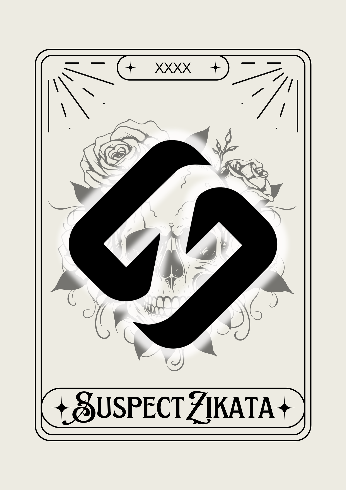

# 👋 Olá, eu sou o SuspectZikata

  

  <strong>Desenvolvedor Full Stack • Bots • Automações</strong>

  Transformando ideias em <b>bots inteligentes</b>, <b>sites funcionais</b> e <b>sistemas completos</b>.

---

## 🚀 Sobre mim

Sou desenvolvedor com foco em **soluções práticas e automações**, atuando principalmente com:

- 🤖 **Bots para Telegram, WhatsApp e Discord**
- 🌐 **Criação de sites e sistemas web**
- 🎨 **Frontend moderno e responsivo**
- ⚙️ **Backend estruturado e escalável**
- 🔄 Integrações com APIs, bancos de dados e automações

Sou autodidata, sempre buscando evoluir tecnicamente e entregar projetos bem organizados, funcionais e fáceis de manter.

---

## 🧠 Áreas de atuação

- Bots de atendimento e automação  
- Sistemas de formulários e gerenciamento  
- Sites institucionais e plataformas web  
- Dashboards administrativos  
- Integrações entre bots, sites e banco de dados  

---

## 🛠️ Tecnologias & Ferramentas

  

---

## 🌐 Onde me encontrar

  

---

## ✨ Objetivo

Criar soluções que **economizam tempo**, **automatizam processos** e **resolvem problemas reais**, seja através de bots, sistemas web ou integrações inteligentes.

---

⭐ Se algum projeto te ajudou, considere deixar uma estrela.  
Isso faz muita diferença 🚀
